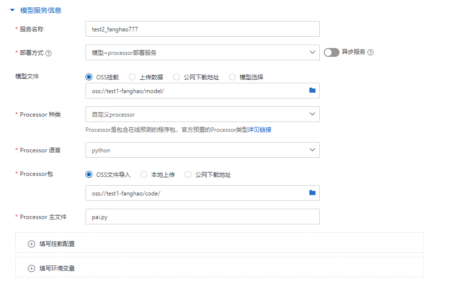
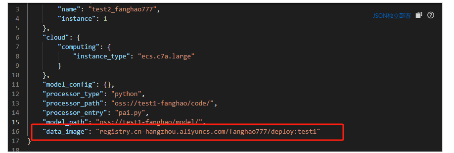

# 在PAI上部署模型

基于第三方的服务部署框架进行模型服务的部署，eg:阿里云的PAI-EAS、海外亚马逊的Sagemaker.....

下面介绍使用Python开发自定义Processor的方式将模型部署至PAI

找到帮助文档和案例：

**使用Python开发自定义Processor：** https://help.aliyun.com/zh/pai/user-guide/develop-custom-processors-by-using-python?spm=a2c4g.11186623.0.i11

### 1.构建开发环境

EAS提供的预构建镜像如下：

```undefined
# 仅安装了Conda的基础镜像。
registry.cn-shanghai.aliyuncs.com/eas/eas-python-base-image:latest
# 安装了Conda及Python3.6和PAI-EAS Allspark 0.15的Python SDK。
registry.cn-shanghai.aliyuncs.com/eas/eas-python-base-image:py3.6-allspark-0.15
```

可以在本地镜像环境中使用`run`​命令来获取该镜像的Python开发环境。以下是以Linux操作系统为例的示例：

```undefined
$sudo docker run -ti registry.cn-shanghai.aliyuncs.com/eas/eas-python-base-image:py3.6-allspark-0.8
(/data/eas/ENV) [root@487a04df**** eas]# ENV/bin/python app.py
```

基于该基础镜像的ENV环境，您可以安装自己的依赖库（例如TensorFlow 1.12），再**将修改过的Container提交为一个数据镜像**。

```undefined
ENV/bin/pip install tensorflow==1.12
docker commit $container_id $image_tag
```

**也可以在Docker外构建ENV开发环境，构建完成后，将其拷贝至任意Docker镜像的/data/eas/目录。** 使用镜像的方式构建开发环境，可以避免每次部署时都将整个ENV环境打包上传，从而提高部署速度。

### 2.编写预测逻辑

在ENV同级目录下，创建预测服务主文件**app.py（这里使用pai_app.py,防止后阿里云自己的文件重复）** ，文件内容示例如下：

```undefined
# -*- coding: utf-8 -*-
import allspark


class MyProcessor(allspark.BaseProcessor):
    """ MyProcessor is a example
        you can send mesage like this to predict
        curl -v http://127.0.0.1:8080/api/predict/service_name -d '2 105'
    """
    def initialize(self):
        """ 
		通过该函数读取模型
        """
        # 需要自定义模型读取
        self.model = load_model(self.model_path)
		# 转换为推理模式
		self.model.eval()

    def pre_process(self, data):
        """ 
		对输入接口的模型进行解码处理
        """
        return str(data, encoding='utf-8')

    def post_process(self, data):
        """ 
		将需要输出的信息转换成二进制
        """
        return bytes(data, encoding='utf8')

    def process(self, data):
        """ 
		对访问数据进行处理
        """
    
        try:
            print(f"每次调用服务接口均会执行该方法:{data}")
            data = self.pre_process(data)
            # 2. 调用模型
            result = self.model.predict(data)
            # 3. 拼接结果返回
            result = {
                'code': 200,
                'msg': '成功',
                'data': {
                    'x': data,
                    'y': result
                }
            }
        except Exception as e:
            logging.error("服务器异常", exc_info=e)
            result = {
                'code': 201,
                'msg': f'服务器异常:{e}'
            }

        # 4. 转换成结果字符串
        result = json.dumps(result, ensure_ascii=False)
        print(f"模型预测结果为:{result}")
        # 5. 结果返回
        return self.post_process(result), 200


if __name__ == '__main__':
    # parameter worker_threads indicates concurrency of processing
    runner = MyProcessor(worker_threads=10)
    runner.run()
```

上述代码即为Python SDK的简单示例，代码中继承了**EAS**提供的基类BaseProcessor，实现了**initialize()** 和**process()** 函数，示例中pre_process和post_process没有用到。

### 3.本地测试服务

**在unix中**

启动pai_app.py程序，如果出现`Service start successfully`​则程序运行成功。

重新打开一个终端，执行以下命令测试应用程序的响应情况。

按照[步骤二](https://help.aliyun.com/zh/pai/user-guide/develop-custom-processors-by-using-python?spm=a2c4g.11186623.0.i11#section-a5j-qpu-otq)给出的示例代码，执行以下命令向应用程序发送两个请求数据，返回结果与代码逻辑对应。

​`curl http://127.0.0.1:8080/test  -d '10 20'`​

### 5.基于pai提供的基础镜像构建自己所需要的镜像（配置环境）

构建镜像

​`docker pull registry.cn-shanghai.aliyuncs.com/eas/eas-python-base-image:py3.6-allspark-0.8`

进入镜像（用于创建并进入容器）

​`docker run -ti registry.cn-shanghai.aliyuncs.com/eas/eas-python-base-image:py3.6-allspark-0.8 /bin/bash`​

在ENV/bin路径下安装环境（即服务运行所需要的包）

​`ENV/bin/pip install -i http://mirrors.aliyun.com/pypi/simple/ --trusted-host mirrors.aliyun.com torch`​

提交部署镜像（输入docker images查看镜像是否提交成功）

​`docker commit 489a5d321a31(这里为镜像id) registry.cn-hangzhou.aliyuncs.com/fanghao/deploy:torch_v1.0`​(这里为自定义的版本名称）

推出部署镜像（具体操作看阿里云镜像服务的指示https://cr.console.aliyun.com/repository/cn-hangzhou/fanghao777/deploy/details）

​`docker push registry.cn-hangzhou.aliyuncs.com/gerry_ai/deploy:torch_v1.0`​

### 4.将代码文件和模型包上传至oss

### 6.部署和测试服务

**部署**

在EAS界面开始创建服务，具体设置如下



模型文件选择路径需要匹配pai_app.py给定的路径

根据代码中给定的`model_dir = "../../model"`​表示模型文件

上传的文件夹到model处即可，不要包含model.pt

同时在配置信息中，应该加入镜像信息：



**测试**

利用python的测试代码如附件
